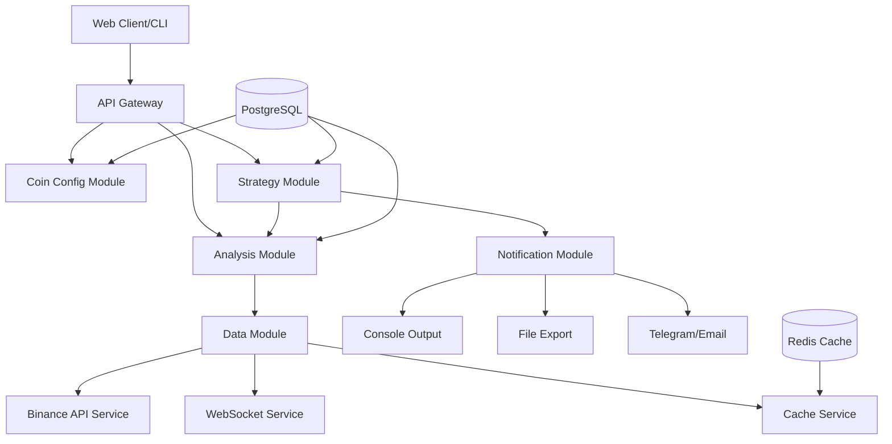

# 多币种图像结构识别与辅助交易策略系统设计文档

## 架构

### 技术栈
- **后端框架**: NestJS + TypeScript
- **数据库**: PostgreSQL (存储配置和历史数据)
- **缓存**: Redis (实时数据缓存)
- **外部API**: Binance REST API + WebSocket
- **包管理**: pnpm

### 系统架构图



### NestJS 模块设计

#### 1. CoinConfigModule
- **Controller**: `CoinConfigController`
  - `POST /api/coins/config` - 添加监控币种
  - `GET /api/coins/list` - 获取监控列表
  - `DELETE /api/coins/:id` - 删除监控配置
- **Service**: `CoinConfigService`
- **DTO**: `CreateCoinConfigDto`, `UpdateCoinConfigDto`
- **Entity**: `CoinConfig`

#### 2. DataModule
- **Service**: `BinanceApiService`, `WebSocketService`, `CacheService`
- **DTO**: `KlineDataDto`
- **Entity**: `KlineData`

#### 3. AnalysisModule
- **Controller**: `AnalysisController`
  - `POST /api/analysis/start` - 启动分析
  - `GET /api/analysis/results/:symbol` - 获取分析结果
- **Service**: `AnalysisService`, `IndicatorService`, `PatternService`
- **DTO**: `AnalysisRequestDto`, `AnalysisResultDto`

#### 4. StrategyModule
- **Controller**: `StrategyController`
  - `POST /api/strategies/signals` - 获取策略信号
- **Service**: `StrategyService`, `BoxTradingStrategy`, `BreakoutStrategy`, `MacdStrategy`
- **DTO**: `StrategySignalDto`

#### 5. NotificationModule
- **Service**: `NotificationService`, `ConsoleService`, `FileService`

## 数据库设计

### 表结构

```sql
-- 币种配置表
CREATE TABLE coin_configs (
    id SERIAL PRIMARY KEY,
    symbol VARCHAR(20) NOT NULL,
    interval VARCHAR(10) NOT NULL,
    is_active BOOLEAN DEFAULT true,
    created_at TIMESTAMP DEFAULT NOW(),
    updated_at TIMESTAMP DEFAULT NOW()
);

-- K线数据表
CREATE TABLE kline_data (
    id SERIAL PRIMARY KEY,
    symbol VARCHAR(20) NOT NULL,
    interval VARCHAR(10) NOT NULL,
    open_time BIGINT NOT NULL,
    close_time BIGINT NOT NULL,
    open_price DECIMAL(20,8) NOT NULL,
    high_price DECIMAL(20,8) NOT NULL,
    low_price DECIMAL(20,8) NOT NULL,
    close_price DECIMAL(20,8) NOT NULL,
    volume DECIMAL(20,8) NOT NULL,
    created_at TIMESTAMP DEFAULT NOW()
);

-- 分析结果表
CREATE TABLE analysis_results (
    id SERIAL PRIMARY KEY,
    symbol VARCHAR(20) NOT NULL,
    interval VARCHAR(10) NOT NULL,
    pattern_type VARCHAR(50) NOT NULL,
    upper_level DECIMAL(20,8),
    lower_level DECIMAL(20,8),
    confidence DECIMAL(3,2),
    analysis_time TIMESTAMP DEFAULT NOW()
);

-- 策略信号表
CREATE TABLE strategy_signals (
    id SERIAL PRIMARY KEY,
    symbol VARCHAR(20) NOT NULL,
    strategy_type VARCHAR(50) NOT NULL,
    signal_type VARCHAR(20) NOT NULL, -- BUY/SELL/HOLD
    price DECIMAL(20,8) NOT NULL,
    confidence DECIMAL(3,2),
    note TEXT,
    created_at TIMESTAMP DEFAULT NOW()
);
```

## 核心算法设计

### 1. 箱体结构识别算法

```typescript
interface BoxPattern {
  upperLevel: number;
  lowerLevel: number;
  touchPoints: number;
  duration: number;
  confidence: number;
}

// 识别逻辑：
// 1. 计算最近N根K线的高点和低点
// 2. 识别水平支撑阻力位
// 3. 统计触碰次数和有效性
// 4. 计算置信度
```

### 2. 突破识别算法

```typescript
interface BreakoutPattern {
  direction: 'UP' | 'DOWN';
  breakoutPrice: number;
  volumeConfirmation: boolean;
  strength: number;
}

// 识别逻辑：
// 1. 检测价格突破关键位置
// 2. 验证成交量是否放大
// 3. 计算突破强度
```

### 3. MACD指标计算

```typescript
interface MacdData {
  macd: number;
  signal: number;
  histogram: number;
  crossover: 'GOLDEN' | 'DEATH' | 'NONE';
}

// 计算逻辑：
// 1. EMA12 和 EMA26 计算
// 2. MACD = EMA12 - EMA26
// 3. Signal = EMA9(MACD)
// 4. 识别金叉死叉
```

## 实现计划

### 阶段1: 基础设施搭建 (1-2天)
1. 项目初始化和依赖安装
2. 数据库配置和实体设计
3. 共享模块创建（enums, interfaces, utils）
4. 基础配置文件设置

### 阶段2: 数据模块开发 (2-3天)
1. Binance API集成
2. WebSocket实时数据服务
3. 数据缓存机制
4. 异常处理和重连逻辑

### 阶段3: 币种配置模块 (1天)
1. 配置管理Controller和Service
2. CRUD操作实现
3. 参数验证和DTO设计

### 阶段4: 分析模块开发 (3-4天)
1. 技术指标计算服务
2. 图形结构识别算法
3. 分析结果存储和查询
4. 分析接口开发

### 阶段5: 策略模块开发 (2-3天)
1. 三种核心策略实现
2. 策略信号生成
3. 决策输出格式化
4. 策略管理接口

### 阶段6: 通知和集成 (1-2天)
1. 通知服务实现
2. 系统集成测试
3. 性能优化
4. 文档完善

## 技术难点与解决方案

### 1. 实时数据处理
- **问题**: WebSocket连接稳定性和数据延迟
- **解决方案**: 实现自动重连、心跳检测、数据缓冲机制

### 2. 算法准确性
- **问题**: 图形结构识别的准确率
- **解决方案**: 多重验证条件、动态阈值调整、历史回测验证

### 3. 性能优化
- **问题**: 大量实时数据处理
- **解决方案**: Redis缓存、数据分片、异步处理

### 4. 容错处理
- **问题**: 网络中断和API限制
- **解决方案**: 指数退避重试、请求限流、降级策略 